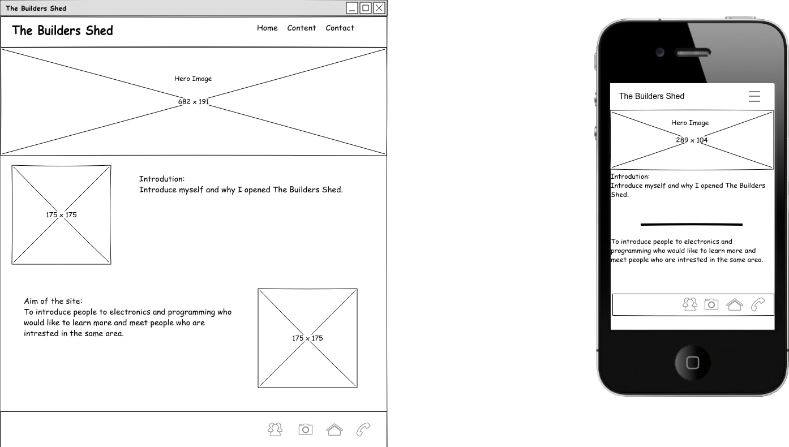
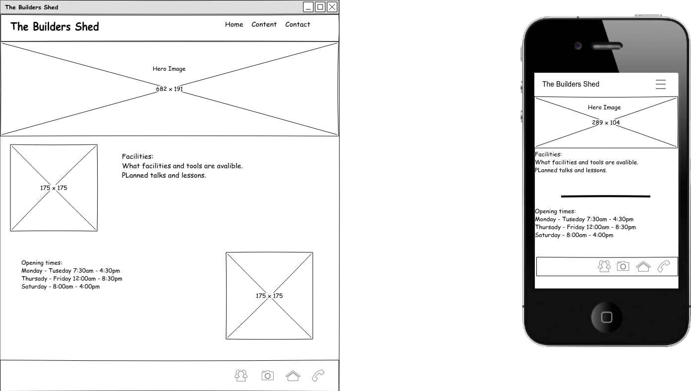

<h1>The Builders Shed</h1> 

<h2>User Centric FrontEnd Development Milestone Project.</h2>

This site is about fictional workshop setup by someone who is passionate 
about electronics and programming.

<h2>UX:</h2>

The website showcases The Builders Shed, a workshop built by an electronics enthusiast, who wanted to create a place for people who wish to learn about electronics and programming but are not sure where to start.

The websites purpose is to showcase the workshop, the tools and the available facilities. The idea is to create a safe and controlled environment where anyone can come to learn how to use tools such as soldering irons, oscilloscopes and power supply's and also learn to programme various languages.

The layout of the website is designed to show what you could expect in the workshop, for example scheduled talks on many different topics, late evening opening so anyone can come in see if The Builders Shed is for them and event nights.

<h2>User Stories</h2>

<h4>User - 1 Electronics Hobbyist</h4>

As an electronics hobbyist I would want to use this platform to meet more people who are also interested in electronics.

<h4>User - 2 Hobbyist Programmer</h4>

As a hobbyist programmer this platform could be very useful in meeting other programmers and people within the software industry.

<h4>User - 3 Parent and child</h4>

As a parent who's child has shown an interest in computers, computer programming or electronics, The Builders Shed would be an ideal place to introduce them to experts within these fields.

<h4>User - 4 Project Builder</h4>

As someone already into electronics but wishing to start a project that requirers more advanced tools, ie: Oscilloscope, Signal Generator. The Builder Shed would be a place where they could rent this equipment for a modest price.

<h4>User - 5 Average Computer User</h4>

As an average computer user wishing to switch from Windows to Linux, The Builders Shed would provide an excellent opportunity to learn about Linux, what it has to offer and how to set up and use Linux.

<h2>Technologies</h2>

The Technologies used in this project are listed bellow.

<ul>
    <li>
        <a href="https://getbootstrap.com/" rel="nofollow">Bootstrap 4</a>
    </li>
    <li>
        <a href="https://en.wikipedia.org/wiki/HTML5" rel="nofollow">HTML5</a>
    </li>
    <li>
        <a href="https://en.wikipedia.org/wiki/CSS" rel="nofollow">CSS3</a>
    <li>
        <a href="https://fontawesome.com/" rel="nofollow">Font Awesome</a>
    </li>
        <li>
        <a href="https://fonts.google.com/" rel="nofollow">Google Fonts</a>
    </li>
    <li>
        <a href="https://github.com/" rel="nofollow">GitHub for version control</a>
    </li>
    <li>
        <a href="https://gitpod.io/" rel="nofollow">Gitpod</a>
    </li>
</ul>

<h2>Wireframe</h2>

The wireframes were created using <a href="https://github.com/evolus/pencil/graphs/contributors" rel="nofollow">Pencil</a> <q>a free and opensource tool for making diagrams and GUI prototyping.</q>

<h4>Home</h4>
 
 <h4>Content</h4>
 
<h4>Contact</h4>

The Builders Shed has changed quite a bit from it's original conception.
Originally the site started out with three pages but as more features were
implemented, it became apparent that three pages would not be enough.

It was also felt that content was too close to contact so the content page became services, I also added an about page to provide a short Bio for each of The Builders Shed experts.

<h2>Media</h2>

All images are from <a href="https://unsplash.com/" rel="nofollow">Unsplash</a> <q>The internet’s source of freely-usable images.</q>
And were edited using <a href="https://www.online-image-editor.com/" rel="nofollow">OIE</a> A free online image editor.

Spelling and grammar was checked using <a href="https://www.reverso.net/spell-checker/english-spelling-grammar/" rel="nofollow">ReversoSpeller</a> an online grammar and spell checker.<p\>

<h2>Features</h2>

Navbar - The Navbar was taken from the Bootstarp example page and adapted for The Builders Shed page. The navbar collapses down for a more compact mobile view.

Home Page - The home page is designed to be the main landing page and too give you a brief description about the builders shed.

Services Page - The Services page is where the bulk of the information is located.
From here you can find information what The Builders Shed has to offer, for example.

<ul>
    <li>Tools and equipment for rental</li>
    <li>Image carousel</li>
    <li>Opening Times</li>
    <li>Tutorial description</li>
</ul>

Contact page - The contact page allows to communicate with the founders of The Builders Shed.
Originally the image carousel was going to be placed on the contact page, but after I decided it would be better placed on the services page.

About page - The about page shows a small bio of each of The Builders Shed experts and their respective expertise.

Footer - Each page contains a footer which has the following information.

<ul>
    <li>The Builders Shed title</li>
    <li>Phone number</li>
    <li>Email address</li>
    <li>Postal address</li>
    <li>Social media bar with links to</li>
    <ul>
        <li>Facebook link</li>
        <li>Twitter link</li>
        <li>LinkedIn link</li>
        <li>Instagram link</li>
        <li>YouTube link</li>
    </ul>
</ul>

<h2>Testing</h2>

The Builders Shed had been tested on various browsers, (Brave, Chrome, Chromium, Firefox) and across a variety of screen sizes.
The Builders Shed works well and meets all expectations.

The Builders shed code has been validated and cleaned on the following.

<ul>
    <li>
        
<a href="https://validator.w3.org/" rel="nofollow">W3C Mark-up Validation Service</a>

    </li>
    <li>
        
<a href="https://jigsaw.w3.org/css-validator/" rel="nofollow">W3C CSS Validation Service</a>

    </li>
    <li>
        
<a href="https://www.10bestdesign.com/dirtymarkup/" rel="nofollow">DirtyMarkup: HTML Beautifier</a>

    </li>
</ul>

<h2>Deployment</h2>

The Builders Shed was deployed using Github Pages, using the following steps.

<ul>
    <li>Navigate to <a href="https://github.com/Darian-Frey/The-Builders-Shed-Milestone-1">github.com/Darian-Frey/The-Builders-Shed-Milestone-1</a></li>
    <li>Go to settings</li>
    <li>scroll to GitHub Pages</li>
    <li>In source select Master and click save.</li>
</ul>

<a href="https://darian-frey.github.io/The-Builders-Shed-Milestone-1/">The Builders Shed</a>

<h2>Credits & Acknowledgements</h2>

I would like to thank the following.

<ul>
    <li>Excellence Ilesanmi for his support and advice through this project.</li>
    <li><a href="https://courses.codeinstitute.net/">Code Institute</a> for this excellent course.</li>
    <li><a href="https://getbootstrap.com/">Bootstrap</a> and <a href="https://www.w3schools.com/">W3Schools</a> for all the example code.</li>
    <li><a href="https://www.youtube.com/">YouTube</a> for the endless streaming music.</li>
    <li>And my partner for her near infinite tolerance of me obsessing over my code.</li>
</ul>

